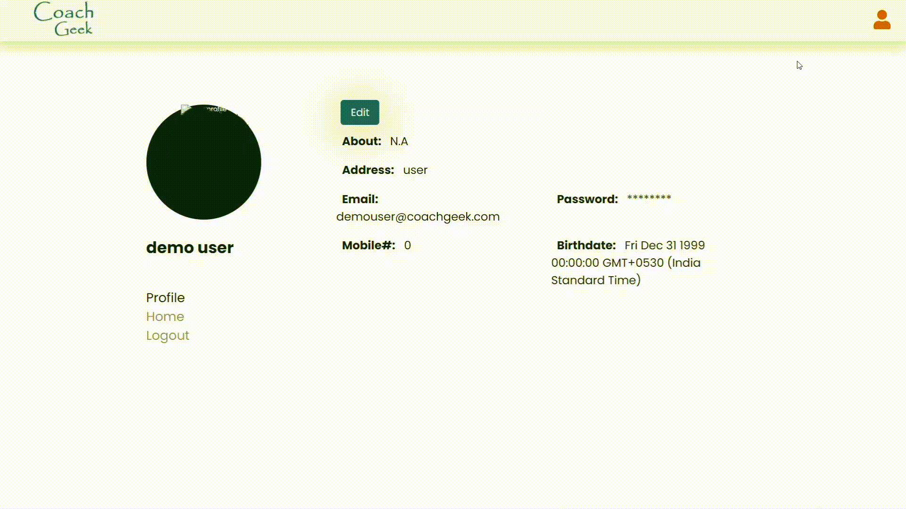

<h1 align="center">
  
   
  Coach Geek - LMS Platform.
</h1>

  Coach Geek is a LMS platform built using <strong><em>HTML, CSS, Javascript, Node.js, Express, JWT and many more</em></strong>. it still doesn't have all the features of LMS platform. it's a similar version of LMS with my own design touch, showing my abilities in Javascript and CSS to build something advanced like LMS. It contains the home page, sign-in page, sign-up page, landing page, Course page, 404 page, etc.
     
  <strong><em>Take a look at the live version here: </em></strong> https://coachgeek.herokuapp.com/ :heart_eyes:

## Table of Contents

- [Project Walk-Through](#project-walk-through)
  - [Landing Page](#landing-page)
  - [Sign-up Page](#sign-up-page)
  - [Log-in Page](#log-in-page)
  - [Home Page](#home-page)
  - [Profile Page](#profile-page)
  - [Task Page](#task-page)
  - [404 Page](#404-page)
- [Live Demo](#live-demo)
- [Technology Used](#technology-used)
- [Author](#author)
- [Show Your Support](#show-your-support)

  - Login as a Demo User with Following details
    - email: demouser@coachgeek.com
    - pass: demouser@
    - Or you can create your accout at https://coachgeek.herokuapp.com/login

# Project Walk-Through

 # Landing Page

***1) Header, includes:***
- Logo: 
it redirects you to the home page when you click on it.

- Sign-in button: 
 it redirects you to the sign-in page.

- Sign-up button: 
 it redirects you to the sign-up page.

***2) Call for Action:***
It redirects you to the sign-up page once you click on the button.

***3) Jumbotron:***
This section contains some images and paragraphs beside it, showing the advantages of Coach Geek. 

***### The page is fully responsive to all mobile devices even the small ones. ###***

 # Log-in Page
 

The Sign-in Page consists of 3 main sections:

***1) Header, includes:***
- Logo: 
it redirects you to the home page when you click on it.

- Sign-in button: 
 it redirects you to the sign-in page.

- Sign-up button: 
 it redirects you to the sign-up page.

***2) Sign-in Form, which includes:***
- Email address input field.

- Password input field.

- Sign-in Button: It has a validation option.

 

***3) Call for Action:***
- Link to Sign-up Page:  it redirects you to the sign-up page.

***### The page is fully responsive to all mobile devices even the small ones. ###***

 # Sign-up Page
 

The Sign-up Page consists of 3 main sections:

***1) Header, includes:***
- Logo: 
it redirects you to the home page when you click on it.

- Sign-in button: 
 it redirects you to the sign-in page.

- Sign-up button: 
 it redirects you to the sign-up page.

***2) Sign-up Form, which includes:***
- First Name input field.

- Last Name input field.

- Email address input field.

- Password input field.

- Sign-up Button: It has a validation option

***3) Call for Action:***
- Link to Sign-in Page:  it redirects you to the sign-in page.

***### The page is fully responsive to all mobile devices even the small ones. ###***

 # Home Page

***1) Header, includes:***
- Logo: 
it redirects you to the home page whenever you click it.

- Hamburger Menu: 
    - Home: redirects to home page
    - Profile: redirects to profile page
    - Logout: which end the user session

***2) Course Detials:***
It contains course name and deatils users may need it.

***3)Task Names:***
It contains course task name and redirects users to the task page.

***### The page is fully responsive to all mobile devices even the small ones. ###***

 # Profile Page

***1) Header, includes:***
- Logo: 
it redirects you to the home page whenever you click it.

- Hamburger Menu: 
    - Home: redirects to home page
    - Profile: redirects to profile page
    - Logout: which end the user session

***2) User Profile:***
It contains User Name and Profile.

***3) Edit Button:***
Allows user to change profile details.

***4)User Details:***
It contains details such as About, Email, etc.

***### The page is fully responsive to all mobile devices even the small ones. ###***

 # Task Page

***1) Header, includes:***
- Logo: 
it redirects you to the home page whenever you click it.

- Hamburger Menu: 
    - Home: redirects to home page
    - Profile: redirects to profile page
    - Logout: which end the user session

- Sidebar Menu: 
    - it has important link that redirects to other task pages.

***2) Task:***
it includes task information and video to watch.

***### The page is fully responsive to all mobile devices even the small ones. ###***

 # 404 Page

***1) Header, includes:***
- Logo: 
it redirects you to the home page whenever you click it.

***2) 404 Animation:***
tells user that this page doesn't exist.

***4) Home Button:***
Takes user to Home page if Logged in else to login page.

***### The page is fully responsive to all mobile devices even the small ones. ###***

# Live Demo

***Take a look on the live version here:*** https://coachgeek.herokuapp.com/ :heart_eyes: 

# Technology Used

I have built this project using the following tools & techniques:
- HTML 5.0
    - Made the structure of the website by identifying the
appropriate elements required
- CSS
- CSS Modules.
    - Styling and align items on the page to make structure accurate,
and for effects such as hover and focus.
- VSCode.
    - IDE- to quickly format and write syntax
- Javascript
- Node.js.
    - for backend server code.
- Express.js.
    - Web framework- to quickly write syntax
    - to easily route user etc
- EJS.
    - Middleware to make HTML code dynamic.
- JWT.
    - JSON WEB TOKEN to add Authentication to Pages.
    - And to send Cookies over web.
- Cookie-Parser.
    - To Manage Cookies.
- Mutler.
    - To parse the images.
- Mongoose.
    - For Creating Schema.
- Mongodb.
    - To Manage and store Data.

# Author

👤 **RaHaT SaYYeD**
- Github: https://github.com/maleficscorpio
- Linkedin: https://www.linkedin.com/in/youreachedrahat
- Email: sayyedrahat721@outlook.com

# Show Your Support

Give a ⭐️ if you like this project!

